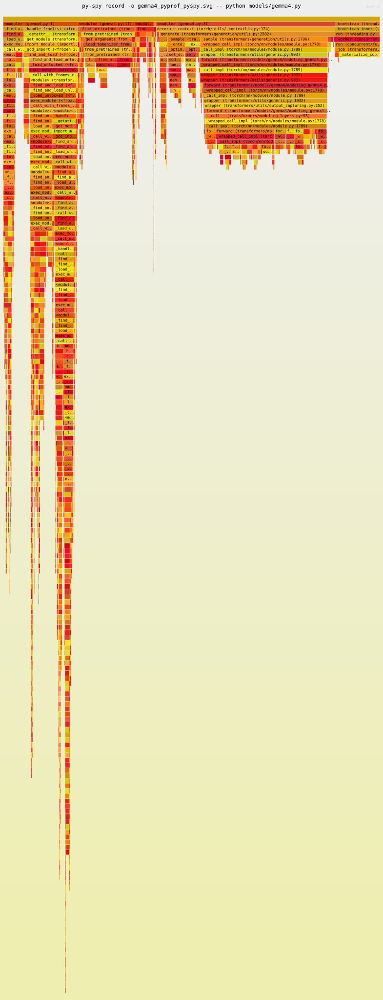

# LLM Profiling Using Nsight and Perf

## Model
`Gemma4` - https://huggingface.co/google/gemma-4-E2B-it

## Setup
- The code [gemma4.py](./../models/gemma4.py) is the sample code from hugging face
- The model was loaded in the first run (stored in disk first time), then the prompt was run
- Added a `print()` line to display the inference contents. Tokens were parsed by the `AutoProcessor` and were returned as a dictionary
for eg. 
```python
  {"role":"assistant","content":"Why did the computer break up with the RAM? Because it felt like their relationship was constantly **overflowing**!"}
```
- No serving system like vLLM was used. Will try that later, to analyze serving overhead.
### Sample Run

## Profiling

### cProfile
No special commands required. I have added a `Profile()` object instantiation, `enable()` and `disable()` calls before and after LLM inference [`model.generate(...)`]. I then used `print_stats()` and `dump_stats()` to obtain the profiling result.

cProfile stats bash output:
```bash
         7170021 function calls (3610985 primitive calls) in 3.603 seconds

   Ordered by: cumulative time
   List reduced from 377 to 10 due to restriction <10>

   ncalls  tottime  percall  cumtime  percall filename:lineno(function)
    305/1    0.001    0.000    3.604    3.604 /home/ninaad/Git/profiling/.venv/lib/python3.12/site-packages/torch/utils/_contextlib.py:120(decorate_context)
        1    0.000    0.000    3.604    3.604 /home/ninaad/Git/profiling/.venv/lib/python3.12/site-packages/transformers/generation/utils.py:2173(generate)
        1    0.010    0.010    3.533    3.533 /home/ninaad/Git/profiling/.venv/lib/python3.12/site-packages/transformers/generation/utils.py:2697(_sample)
106552/152    0.044    0.000    2.665    0.018 /home/ninaad/Git/profiling/.venv/lib/python3.12/site-packages/torch/nn/modules/module.py:1774(_wrapped_call_impl)
106552/152    0.095    0.000    2.665    0.018 /home/ninaad/Git/profiling/.venv/lib/python3.12/site-packages/torch/nn/modules/module.py:1782(_call_impl)
  304/152    0.002    0.000    2.664    0.018 /home/ninaad/Git/profiling/.venv/lib/python3.12/site-packages/transformers/utils/generic.py:897(wrapper)
      152    0.008    0.000    2.663    0.018 /home/ninaad/Git/profiling/.venv/lib/python3.12/site-packages/transformers/models/gemma4/modeling_gemma4.py:2471(forward)
  304/152    0.002    0.000    2.638    0.017 /home/ninaad/Git/profiling/.venv/lib/python3.12/site-packages/transformers/utils/generic.py:970(wrapper)
      152    0.009    0.000    2.634    0.017 /home/ninaad/Git/profiling/.venv/lib/python3.12/site-packages/transformers/models/gemma4/modeling_gemma4.py:2215(forward)
      152    0.002    0.000    2.562    0.017 /home/ninaad/Git/profiling/.venv/lib/python3.12/site-packages/transformers/utils/output_capturing.py:221(wrapper)
```
SnakeViz output (I don't understand these visualizations yet): [snakeviz-output](./../models/gemma4_pyprof.html)

### Scalene
The bash logs showed that profiler was started and stopped multiple times, but no output was shown, took too long.

### Py-Spy
Command:

```bash
py-spy record -o gemma4_pyprof_pyspy.svg -- python models/gemma4.py
```

Example Flame Graph:


### Perf
Run `nsys` profiler:
```bash
nsys profile -o gemma4_nsys python models/gemma4.py
```
Other profiling options with `nsys`:
```bash
# Basic GPU profiling
nsys profile -o gemma4_nsys python models/gemma4.py

# Include CPU sampling
nsys profile -o gemma4_nsys -s cpu,gpu python models/gemma4.py

# With memory profiling
nsys profile -o gemma4_nsys -s cpu,gpu,mem python models/gemma4.py

# Detailed GPU metrics
nsys profile -o gemma4_nsys --gpu-metrics all python models/gemma4.py
```
Visualization:
```bash
# Opens GUI on your machine (requires X11/display)
nsys-ui gemma4_nsys.nsys-rep
```

