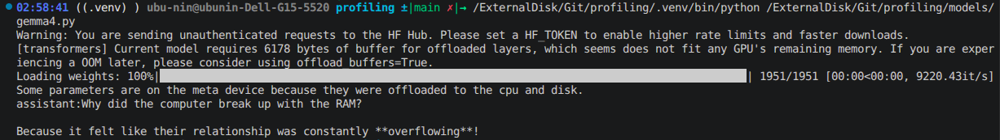

# LLM Profiling Using Nsight and Perf

## Model
`Gemma4` - https://huggingface.co/google/gemma-4-E2B-it

## Setup
- The code [gemma4.py](./../models/gemma4.py) is the sample code from hugging face
- The model was loaded in the first run (stored in disk first time), then the prompt was run
- Added a `print()` line to display the inference contents. Tokens were parsed by the `AutoProcessor` and were returned as a dictionary
for eg. 
```python
  {"role":"assistant","content":"Why did the computer break up with the RAM? Because it felt like their relationship was constantly **overflowing**!"}
```
- No serving system like vLLM was used. Will try that later, to analyze serving overhead.
### Sample Run

## Profiling

### Latency Analysis
- Done using python system/os calls